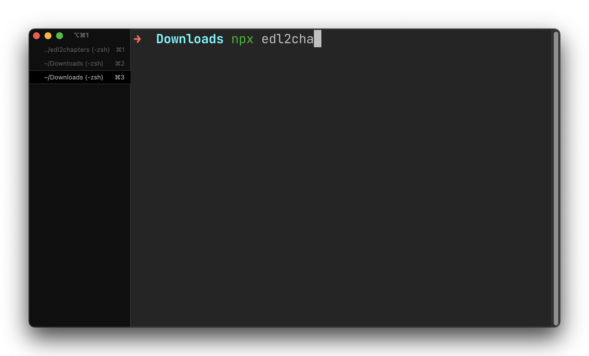

# `edl2chapters`



This is a simple tool to convert an EDL file from video editing apps to a list of chapters that YouTube can use to create a table of contents for your video.

## Usage

```
npx edl2chapters [file]
```

This will output chapters to `stdout`, and then you can pipe it to copy or to a new file.

```
npx edl2chapters [file] | pbcopy
```

## Supported Video Editing Apps

- Adobe Premiere Pro
- Avid Media Composer
- DaVinci Resolve
- Blender supports EDL in versions 2.4x and versions from 2.66
- Cinelerra
- Digital Vision Nucoda and Phoenix
- Thydrjs Dream II and Xynergi systems
- Final Cut Pro
- Lightworks
- MediaCoder
- Shotcut
- The Foundry HIERO
- Rally Access

Enjoy!
